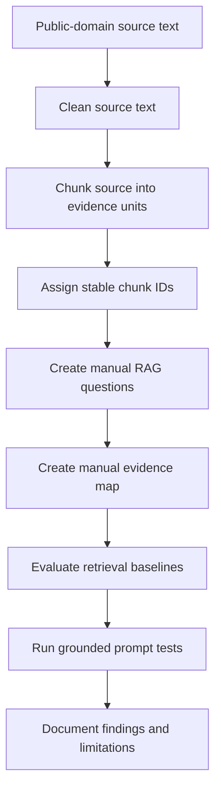

# Local Scriptorium

Local Scriptorium is a local RAG-style research assistant experiment built to test source-grounded question answering over public-domain texts.

The goal is not to build a polished chatbot. The goal is to understand and demonstrate the core pipeline behind trustworthy retrieval-augmented generation:

```text
source text
→ cleaning
→ chunking
→ retrieval
→ grounded prompting
→ evaluation
```

The first MVP uses Boethius’ *The Consolation of Philosophy* as the evaluated source corpus.

## Why This Project Exists

Modern AI assistants often sound confident even when their answers are weakly grounded.

This project explores a practical question:

> Can a local AI system retrieve the right source evidence and use it to answer questions accurately?

To answer that, Local Scriptorium separates two problems that are often blurred together:

1. **Retrieval quality**  
   Did the system find the right chunks?

2. **Generation quality**  
   Did the model use those chunks correctly?

The current MVP focuses heavily on retrieval evaluation and documents where local grounded generation succeeds or fails.

## MVP Scope

Evaluated source:

- Boethius, *The Consolation of Philosophy*
- Translator: H. R. James
- Source type: public-domain English translation
- Source ID: `BOETHIUS_CONSOLATION_001`

Candidate sources downloaded but not yet evaluated:

- Plato, *Apology*
- Plato, *Apology / Crito / Phaedo*
- Augustine, *Confessions*
- Augustine, *City of God*, Vol. I

Only Boethius is included in the current retrieval evaluation.

## Current Pipeline



## Repository Structure

```text
chunks/
  boethius_consolation_chunks.json

docs/
  chunking_inspection_notes.md
  grounding_failure_notes.md
  retrieval_baseline_comparison.md
  source_corpus_selection.md

evals/
  manual_rag_questions.md
  manual_rag_chunk_map.md

outputs/
  keyword_retrieval_eval.md
  bm25_retrieval_eval.md
  vector_retrieval_eval.md
  hybrid_retrieval_eval.md
  manual_rag_prompt_test.md
  manual_rag_prompt_test_v2.md

scripts/
  clean_gutenberg_text.py
  chunk_source.py
  search_chunks.py
  evaluate_keyword_retrieval.py
  evaluate_bm25_retrieval.py
  evaluate_vector_retrieval.py
  evaluate_hybrid_retrieval.py
  run_manual_rag_test.py

sources_public/
  raw/
  processed/
```

## Evaluation Method

A manual evaluation set was created before testing retrieval.

The evaluation set includes:

- 10 RAG questions
- manually selected expected evidence chunks
- question types including factual, interpretive, conceptual, synthesis, and insufficient-evidence questions

The key retrieval metric is `Recall@5`:

```text
Recall@5 = expected chunks found in top 5 retrieved chunks / total expected chunks
```

Precision@5 is also tracked where available:

```text
Precision@5 = expected chunks found in top 5 retrieved chunks / 5
```

Recall measures whether the retriever found the needed evidence.

Precision measures how much noise appeared in the retrieved set.

## Retrieval Baseline Results

| Retrieval Method | Description | Average Recall@5 | Average Precision@5 |
|---|---|---:|---:|
| Keyword count | Simple query-term frequency baseline | 0.34 | Not measured |
| BM25 | Standard lexical retrieval baseline | 0.47 | 0.30 |
| Vector | Embedding / semantic retrieval using `embeddinggemma` | 0.49 | 0.34 |
| Hybrid | 50/50 BM25 + vector retrieval | 0.55 | 0.36 |

## Main Retrieval Finding

Hybrid retrieval performed best overall.

The results show that no single retrieval method was perfect:

- keyword count was too brittle
- BM25 improved exact-term matching
- vector retrieval helped with semantic similarity but was uneven
- hybrid retrieval produced the strongest overall result

The current MVP retrieval strategy is therefore:

```text
Hybrid retrieval = 50% BM25 + 50% vector similarity
```

Weights were not tuned because the evaluation set is small. Tuning on 10 questions would risk overfitting.

## Grounded Generation Findings

The project also tested local model answers with and without supplied source chunks.

Local model used:

```text
llama3.2:1b
```

The key finding:

> Relevant chunks plus a source-use instruction do not guarantee a good grounded answer.

Even when the model was given relevant chunks, it sometimes:

- failed to cite chunk IDs
- missed the central source relationship
- introduced unsupported context
- failed insufficient-evidence questions
- struggled with literary/allegorical material

This means retrieval and generation must be evaluated separately.

## Known Limitations

This is an MVP, not a production RAG system.

Known limitations:

- only one evaluated source corpus
- small 10-question evaluation set
- manual evidence map is first-pass, not definitive
- local 1B model is weak for reliable grounded interpretation
- broad synthesis questions may need more than top-5 retrieval
- insufficient-evidence questions require stronger answer discipline
- no production vector database
- no UI
- no automated grading of generated answers yet

## What This Project Demonstrates

This project demonstrates practical understanding of:

- local inference with Ollama
- public-source corpus preparation
- source cleaning
- chunking strategy
- stable chunk IDs
- manual RAG evaluation design
- evidence mapping
- keyword retrieval baseline
- BM25 lexical retrieval
- vector / embedding retrieval
- hybrid retrieval
- Recall@5 and Precision@5
- grounding failure analysis
- separation of retrieval quality from answer-generation quality

## How to Reproduce

The keyword and BM25 baselines use only the Python standard library. Python 3.10 or newer is sufficient.

From the repo root:

```bash
python3 scripts/chunk_source.py
python3 scripts/evaluate_keyword_retrieval.py
python3 scripts/evaluate_bm25_retrieval.py
python3 scripts/evaluate_vector_retrieval.py
python3 scripts/evaluate_hybrid_retrieval.py
```

To run the local grounded prompt comparison:

```bash
python3 scripts/run_manual_rag_test.py
```

Vector and hybrid retrieval require Ollama and an embedding model:

```bash
ollama pull embeddinggemma
```

## Licensing And Corpus Provenance

Project code and original documentation are MIT licensed. The bundled source text keeps its own provenance and terms; see [CORPUS_NOTICE.md](CORPUS_NOTICE.md) and `sources_public/source_manifest.json`.

## Key Artifacts

Retrieval comparison:

```text
docs/retrieval_baseline_comparison.md
```

Grounding failure analysis:

```text
docs/grounding_failure_notes.md
```

Manual question set:

```text
evals/manual_rag_questions.md
```

Manual evidence map:

```text
evals/manual_rag_chunk_map.md
```

Best retrieval output:

```text
outputs/hybrid_retrieval_eval.md
```

## MVP Status

Current status:

```text
MVP retrieval evaluation complete.
Hybrid retrieval selected as the strongest baseline.
Grounded generation limitations documented.
```

Next packaging step:

```text
Create project case study.
```
