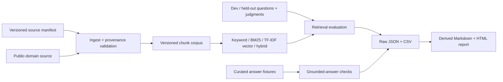

# Local Scriptorium

Local Scriptorium is a small, reproducible harness for evaluating retrieval-augmented generation (RAG) locally. It asks two separate questions: did retrieval find the evidence, and did an answer stay within that evidence? The default path is deterministic, offline, and requires no model server, API key, or network access.

## Results at a glance

The committed values below come from the v0.2 held-out test artifact and must be refreshed from an actual run before release.

<!-- BENCHMARK_START -->
| Method | Recall@5 | Precision@5 | Hit rate@5 | MRR | nDCG@5 |
|---|---:|---:|---:|---:|---:|
| Keyword | 0.742 | 0.210 | 0.900 | 0.643 | 0.592 |
| BM25 | 0.808 | 0.230 | 0.900 | **0.729** | **0.715** |
| Offline TF-IDF vector | **0.833** | **0.230** | **0.950** | 0.685 | 0.690 |
| Hybrid RRF | 0.808 | **0.230** | 0.900 | 0.693 | 0.694 |

On the 20-question held-out split, the vector baseline had the highest Recall@5 (95% bootstrap CI 0.700–0.933); BM25 had the highest MRR and nDCG@5. The overlapping uncertainty and small dataset do not support declaring a universal winner.
<!-- BENCHMARK_END -->

These measurements cover one public-domain translation and a manually curated 20-question held-out split. They are regression evidence, not proof of general RAG quality.

## Why this exists

Confident prose can hide two different failures: missing evidence and misuse of evidence. This project makes them inspectable independently. It is primarily an evaluation harness, not a chatbot or a claim that one retrieval recipe is universally best.

## Architecture



The `src/local_scriptorium/` package owns contracts, ranking, metrics, orchestration, and reporting. Historical scripts remain available, but their new outputs are isolated under `outputs/generated/legacy/`.

## Five-minute offline quick start

Python 3.11 or newer is required.

```bash
python -m venv .venv
source .venv/bin/activate
python -m pip install -e .
scriptorium ingest
scriptorium retrieve "How is providence distinguished from fate?" --method bm25
scriptorium evaluate --split test --deterministic
scriptorium report
```

Generated artifacts appear in `outputs/generated/` and are intentionally ignored. Raw results include detailed JSON plus aggregate and per-ranking CSV files. Override that location with the top-level `--output` option for CI or fixtures.

## CLI

```text
scriptorium ingest                         validate provenance and materialize corpus
scriptorium retrieve QUERY --method bm25  inspect ranked evidence as JSON
scriptorium evaluate                      tune only on the development split
scriptorium evaluate --split test         explicitly run the held-out split
scriptorium report                        derive reports from raw artifacts
```

Commands return non-zero status for invalid data or arguments and emit machine-readable retrieval output. `evaluate` defaults to `dev` to reduce accidental test-set tuning.

## Evaluation methodology

The dataset contains 50 evidence-backed questions: 30 development and 20 held-out test. Each question maps to one or more chunk IDs with graded relevance (1-3). The harness reports Recall@5, Precision@5, Hit Rate@5, MRR, and nDCG@5. Seeded, 2,000-sample non-parametric bootstrap confidence intervals estimate variation over questions.

The failure taxonomy distinguishes complete misses, partial evidence, low rank, distractor-heavy results, and successful retrieval. Grounded-answer fixtures check citation membership, curated unsupported-claim labels, answerability, and refusal behavior. Those checks are explicitly heuristic and not objective ground truth.

### Retrieval methods

- `keyword`: query-term frequency baseline.
- `bm25`: in-memory BM25 lexical ranking.
- `vector`: offline TF-IDF vectors with cosine similarity; this is not a dense semantic model.
- `hybrid`: reciprocal-rank fusion of BM25 and the offline vector baseline.

The deterministic baseline uses only Python's standard library. Historical Ollama dense-vector and local-generation experiments are preserved in `scripts/` and `docs/analysis/`.

## Optional local model and dense-vector setup

Optional historical experiments require a running [Ollama](https://ollama.com/) installation and locally pulled models such as `embeddinggemma` and `llama3.2:1b`. They are not installed, downloaded, or contacted by CI. The `vector` extra is reserved for future numeric acceleration:

```bash
python -m pip install -e '.[vector]'
```

Dense Ollama results must be labelled separately from the offline TF-IDF baseline and include model/version metadata.

## Data contracts and provenance

All active JSON artifacts declare schema version `1.0`. The source manifest requires source, license, SHA-256 checksum, ingestion date, permitted use, and portable processed path. Ingestion rejects missing, malformed, absent, or checksum-mismatched sources. See [DATA_CORPUS_NOTICE.md](DATA_CORPUS_NOTICE.md) and [CORPUS_NOTICE.md](CORPUS_NOTICE.md).

Committed inputs include the processed public-domain source, chunk corpus, question judgments, and deterministic answer fixtures. Machine runs, embedding caches, local models, raw downloads, private sources, and credentials are ignored. Curated interpretation belongs in `docs/analysis/`; generated evidence belongs in `outputs/generated/`.

## Reproducing validation

```bash
python -m pip install -e '.[dev]'
ruff check .
python -m unittest discover -s tests -v
scriptorium ingest
scriptorium evaluate --split test --deterministic
scriptorium report
python scripts/privacy_check.py
```

## Limitations

- One work, one translation, and one chunking configuration limit external validity.
- Relevance labels are manually curated but not independently adjudicated by a Boethius scholar.
- Held-out protection is procedural rather than access-controlled.
- TF-IDF cosine similarity is not a dense semantic embedding evaluation.
- Answer fixtures test known labels; they do not measure open-ended generation quality.
- Confidence intervals cover question sampling only, not label, corpus, or model uncertainty.

See [docs/data_contracts.md](docs/data_contracts.md), [docs/analysis/v0.2_methodology.md](docs/analysis/v0.2_methodology.md), and the generated report for the exact run record.

## Project documents

- [CONTRIBUTING.md](CONTRIBUTING.md)
- [SECURITY.md](SECURITY.md)
- [CHANGELOG.md](CHANGELOG.md)
- [CORPUS_NOTICE.md](CORPUS_NOTICE.md)
- [DATA_CORPUS_NOTICE.md](DATA_CORPUS_NOTICE.md)
- [docs/demo/offline_demo.md](docs/demo/offline_demo.md)
