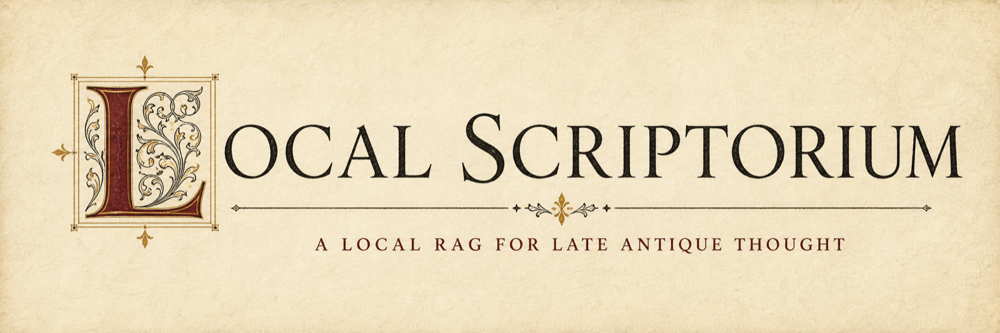
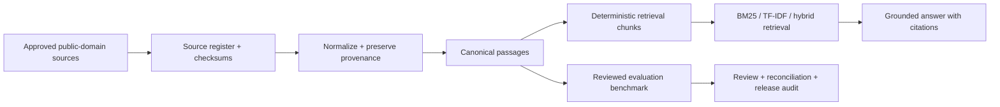

# Local Scriptorium

[](https://github.com/czzzry/local-scriptorium/actions/workflows/ci.yml)

Local Scriptorium is a reproducible, local-first RAG evaluation harness for asking questions of historical texts without hiding the evidence. It separates retrieval quality (did we find the right passage?) from answer quality (did the response stay within that passage?). The default workflow is deterministic and offline: no API key, model server, or network connection is required.

The current v0.3 project is an era-specific RAG corpus for Late Antique thought. It ingests nine public-domain source units—Augustine, Boethius, Iamblichus, Proclus, Pseudo-Dionysius, and Plotinus—then preserves provenance from source edition to passage, chunk, citation, evaluation question, and review decision.

## Try it in one minute

The repository includes the public corpus and needs no API key, model server, or network connection:

```bash
make demo
```

The command retrieves relevant passages for a sample question, prints their stable citations, and produces a deliberately conservative grounded answer. Nothing is downloaded and no model is called.

Example shape:

```text
Question: How do providence and fortune differ?
Answer: The retrieved local passages concern Boethius and Proclus...
Citations: BOETHIUS_CONSOLATION_001:c0060, ...
Grounded evidence:
[1] Boethius — BOETHIUS_CONSOLATION_001:c0060
```

## Install the CLI

```bash
python -m venv .venv
source .venv/bin/activate
python -m pip install -e '.[dev]'
```

```bash
scriptorium --pack late-antiquity-core-v1 ingest
scriptorium --pack late-antiquity-core-v1 ask "How do providence and fortune differ?"
```

The interactive `ask` command prints grounded passages with source identifiers. Generation is optional and deterministic for demonstrations:

```bash
scriptorium --pack late-antiquity-core-v1 ask \
  "How do providence and fortune differ?" --generate fake
```

## Project wordmark



The wordmark uses an illuminated-manuscript initial and scholarly colophon styling to give the project an antique identity without turning the CLI into a decorative art demo.

## What v0.3 contains

- **Nine-source Late Antique corpus:** selected works and translations by Augustine, Boethius, Iamblichus, Proclus, Pseudo-Dionysius, and Plotinus.
- **Provenance-preserving ingestion:** source-register validation, checksums, edition metadata, canonical passage IDs, and deterministic normalization.
- **Canonical passages before chunks:** passage anchors remain stable when chunking configurations change.
- **Retrieval baselines:** keyword search, BM25, offline TF-IDF vectors, and hybrid reciprocal-rank fusion.
- **Grounded answers:** citations, uncertainty language, and refusal when the corpus cannot support a claim.
- **Evaluation benchmark:** 100 candidates were reviewed; 70 were accepted and 30 front-matter-only prompts were explicitly excluded.
- **Project-local reviewer:** blinded packets, schema validation, reconciliation, adjudication, stale-review checks, and a fail-closed release audit.

The full core pack currently contains 13,875 canonical passages and 2,008 retrieval chunks. The accepted benchmark is engineering evaluation evidence—not classics-scholar consensus or gold-standard truth.

## Useful commands

```bash
# Inspect and validate a pack
scriptorium --pack late-antiquity-core-v1 validate-pack

# Build or rebuild its corpus
scriptorium --pack late-antiquity-core-v1 ingest

# Retrieve evidence as JSON
scriptorium --pack late-antiquity-core-v1 retrieve \
  "What is the relation between providence and fate?" --method bm25

# Run the reviewed v0.3 evaluation
scriptorium evaluate-v2 \
  --questions data/evaluation/late-antiquity-core-questions-v2.accepted.json \
  --corpus outputs/generated/packs/late-antiquity-core-v1/corpus.v1.json \
  --output outputs/generated/packs/late-antiquity-core-v1/evaluation_v2_bm25.json

# Run the release gate
python scripts/release_audit_v3.py \
  --register sources_public/source_register.v2.json \
  --pack data/packs/late_antiquity_core.v1.json \
  --questions data/evaluation/late-antiquity-core-questions-v2.accepted.json \
  --review-policy data/reviews/review_policy.v1.json
```

The smaller `late-antiquity-tracer-v1` and `late-antiquity-available-v1` packs remain available for quick demonstrations and calibration.

## How the system is evaluated

The evaluation workflow is intentionally split into two layers:

1. **Retrieval:** measure whether acceptable evidence appears in the ranked results.
2. **Grounded answering:** check citation membership, unsupported-claim boundaries, answerability, and refusal behavior.

The v0.3 benchmark includes single-passage questions, within-work synthesis, source attribution, cross-author comparison, concept tracing, and explicit unanswerable cases. Interpretation-sensitive and translation-sensitive items carry caveats rather than being forced into false certainty.

The project-local `review-classics` protocol is a consistency and governance mechanism. It does not turn an AI reviewer into a classics scholar. Questions involving original-language wording, contested authorship, chronology, or specialist doctrine must be externally adjudicated or excluded.

## Architecture



## Repository guide

- [`src/local_scriptorium/`](src/local_scriptorium/) — contracts, ingestion, retrieval, evaluation, generation, review, and CLI.
- [`sources_public/source_register.v2.json`](sources_public/source_register.v2.json) — approved source scope and checksums.
- [`data/packs/`](data/packs/) — frozen corpus-pack definitions.
- [`data/evaluation/`](data/evaluation/) — candidate and accepted benchmark artifacts.
- [`data/reviews/`](data/reviews/) — review policy, controls, and adjudications.
- [`docs/v0.3_prd.md`](docs/v0.3_prd.md) — product requirements.
- [`docs/v0.3_implementation_plan.md`](docs/v0.3_implementation_plan.md) — implementation decisions and phase gates.
- [`docs/v0.3_review_runbook.md`](docs/v0.3_review_runbook.md) — reviewer execution and release procedure.
- [`docs/analysis/v0.3_case_study.md`](docs/analysis/v0.3_case_study.md) — interview-ready engineering/client-boundary explanation.
- [`docs/analysis/v0.3_implementation_log.md`](docs/analysis/v0.3_implementation_log.md) — evidence for each completed phase.

## Validation

```bash
make lint
make test
make release-audit
git diff --check
```

The current regression suite contains 48 tests. Generated runs, local models, embedding caches, raw downloads, private sources, and credentials are kept out of the committed project artifacts.

## Limitations

- Public-domain translations are not equivalent to original-language critical editions.
- Retrieval metrics measure this corpus and benchmark, not general RAG performance.
- The reviewer provides procedural consistency evidence, not scholarly certification.
- The README wordmark is a raster brand asset; terminal output remains plain and automation-safe.

## Project status

v0.3 is complete as an auditable local evaluation project. The release gate is green. Future work can improve the benchmark questions, add specialist spot checks, compare stronger embedding/reranking models, or add a web interface without changing the provenance and review boundaries established here.
